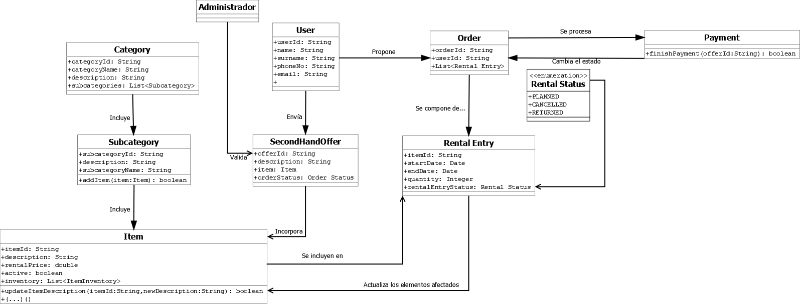
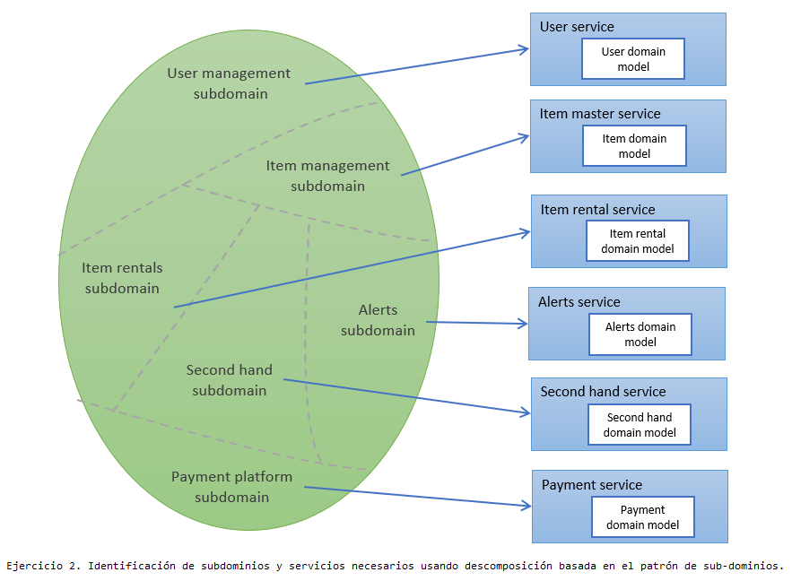
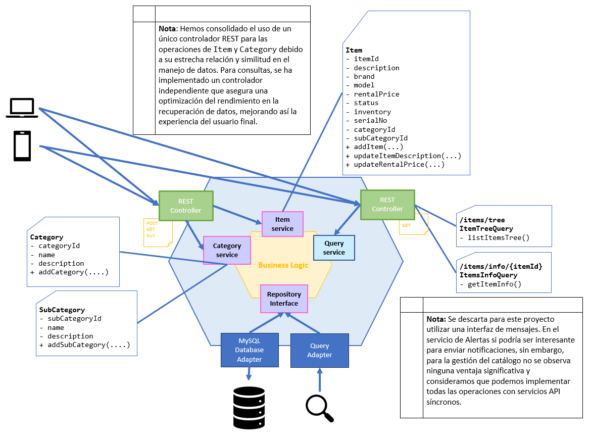
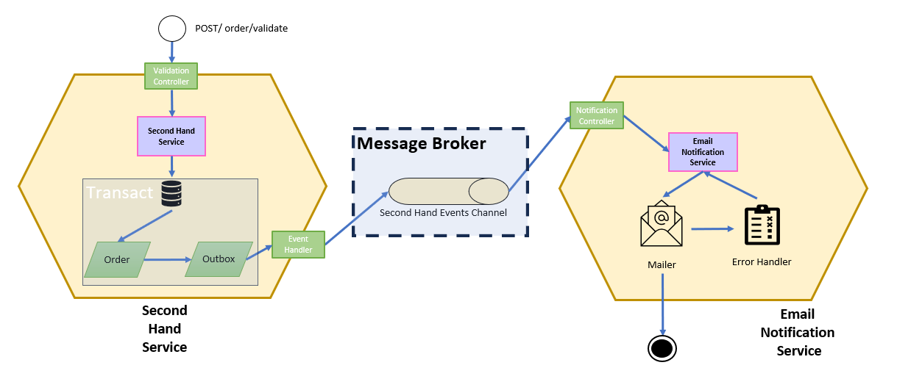

# Ejercicio 1. 

## 1.1. Operaciones del sistema - patrón CQRS.

### Comandos de usuario

|Actor|Caso de Uso|Comando|Descripción|
|-|-|-|-|
| Usuario  | Darse de alta en la aplicación                                              | `addUser()`         | Permite a un nuevo usuario darse de alta en la aplicación.                                       |
| Usuario  | Actualizar datos del usuario (nombre, apellidos, teléfono o correo)         | `updateUserData()`  | Permite la actualización de los datos del usuario.                                               |
| Usuario  | Dar de baja al usuario de la plataforma                                     | `removeUser()`      | Permite la baja de un usuario en la base de datos, si se cumplen ciertas condiciones.            |
| Usuario  | Acceder a la aplicación                                                     | `loginUser()`       | Autentica al usuario y permite la visualización de funcionalidades para usuarios registrados.   |

**Nota:** Se obvian muchas operaciones de usuarios que serían deseables en la app, como por ejemplo: 

`resetUserPassword()`
 `logOutUser()` 
 `sendConfirmationEmail()`

### Consultas de usuario

|Actor|Caso de Uso|Consulta|Descripción|
|-|-|-|-|
| Administrador | Buscar usuarios por medio de un parámetro o varios parámetros      | `searchUsers()` | Busca usuarios coincidentes en el sistema basados en los parámetros proporcionados.              |
| Usuario       | Revisar los datos que la aplicación tiene recogidos                | `getUserInfo()` | Accede a los datos informados durante su registro: nombre, apellidos, teléfono y correo electrónico. |

### Comandos de categoría y subcategoría

|Actor|Caso de Uso|Comando|Descripción|
|-|-|-|-|
| Administrador | Añadir una nueva categoría al árbol de categorías/subcategorías/artículos | `addCategory()`    | Este comando se utiliza para añadir una nueva categoría a la base de datos.                      |
| Administrador | Añadir una nueva subcategoría al árbol de categorías/subcategorías/artículos | `addSubCategory()` | Este comando se utiliza para añadir una nueva subcategoría a una categoría existente en la base de datos. |

### Consultas de categoría y subcategoría

|Actor|Caso de Uso|Consulta|Descripción|
|-|-|-|-|
| Usuario/Administrador | Visualizar todo el árbol de artículos disponibles                  | `listItemsTree()`  | Esta query permite el acceso a los artículos dados de alta, desde los niveles más altos al mayor nivel de detalle (incluidos los números de serie de cada artículo). La consulta permite la entrada de filtros por categoría, subcategoría e item. Además cuenta con un parámetro booleano -showSerialNos- que, en caso de ser = true muestra los números de serie que hay por cada artículo (en caso de existir), en caso de ser = false, nos ofrece detalle hasta los artículos, no incluyendo los números de serie. |

**Nota:** Se podrían realizar consultas adicionales más específicas de listItemsCategory o listItemsSubCategory, pero dado que los filtros de listItemsTree() permiten realizar todas las consultas posibles de forma dinámica, no vamos a incluir más consultas de este tipo.

### Comandos de artículo

|Actor|Caso de Uso|Comando|Descripción|
|-|-|-|-|
| Administrador | Añadir una nueva referencia de artículo                            | `addItem()`                | Este comando se utiliza para añadir un nuevo artículo a la base de datos.                        |
| Administrador | Actualización de la descripción de un artículo                     | `updateItemDescription()`  | Este comando actualiza la descripción de un artículo dado en función de la nueva descripción facilitada por el administrador. |
| Administrador | Actualización del precio de alquiler por día de un artículo        | `updateRentalPrice()`      | Este comando actualiza el precio de alquiler por día de un artículo dado, pero sólo si el artículo no tiene unidades comprometidas en ningún alquiler. |
| Usuario       | Saber si se produce algún cambio en la disponibilidad de un artículo en un rango específico de fechas | `createItemAlert()` | Este comando programa una alerta que se disparará en caso de que un determinado artículo pase a estar disponible en un rango de fechas determinado por el usuario. |
| Usuario       | Dar de baja un artículo                                           | `deactivateItem()`         | Cumpliendo las precondiciones requeridas (no hay unidades comprometidas en alquiler), se bloquea el producto, atributo 'Status = Non-operational'. Este artículo no se listará en ninguna query ni se procesará a través de ningún comando ejecutado por usuarios no administradores. |

### Consultas de artículo

|Actor|Caso de Uso|Consulta|Descripción|
|-|-|-|-|
|Usuario /Administrador|El usuario quiere acceder a la descripción del artículo|`getItemInfo()`|Esta consulta accede a la información básica de un artículo, como puede ser su nombre y descripción.|
|Usuario /Administrador|Se necesita conocer la disponibilidad de un artículo determinado en un intervalo de fechas|`getItemAvailability()`|Esta consulta accede a la información de un artículo, es decir, la descripción y la cantidad disponible del artículo para su alquiler a una fecha dada. Si no se especifica fecha, por defecto tomará la fecha del día de trabajo para la fecha de inicio. El usuario gestionará los filtros de fecha que le resulten relevantes para conocer las disponibilidades planificadas por el sistema, pudiendo además aplicar fecha fin, que por defecto será igual a la fecha de inicio.|
|Administrador|Se necesita conocer el estado del stock de un artículo determinado en un intervalo de fechas|`getItemAvailabilityDetailed()`|Esta consulta es muy similar a la indicada previamente, sin embargo, aporta datos adicionales, en concreto nos indica no solo las unidades disponibles para una fecha en concreto, también nos ofrece información sobre el stock de unidades estropeadas/no operativas y nos indica cuándo se iniciaron y cuándo van a finalizar los alquileres en curso para las unidades que están alquiladas a la fecha indicada.|

### Comandos de alquiler

|Actor|Caso de Uso|Comando|Descripción|
|-|-|-|-|
|Administrador|Este comando gestiona los estados de "planificado", "cancelado" y "devuelto" de los alquileres de material|`manageRentalStatus()`|Este comando permite al administrador gestionar los estados de los alquileres de material.|

### Comandos del servicio de segunda mano

|Actor|Caso de Uso|Comando|Descripción|
|-|-|-|-|
|Usuario|El usuario envía una oferta de un producto de segunda mano que tiene disponible.|`submitSecondHandOffer()`|Este comando permite a un usuario registrado enviar una oferta de un producto de segunda mano. La oferta queda en estado pendiente de validación en la plataforma.|
|Administrador|El administrador valida la oferta de un producto de segunda mano.|`validateSecondHandOffer()`|Este comando permite a un administrador validar una oferta de un producto de segunda mano. Si el artículo está en buenas condiciones, se incorpora al stock de unidades disponibles para alquiler.|

### Consultas del servicio de segunda mano

|Actor|Caso de Uso|Consulta|Descripción|
|-|-|-|-|
|Administrador|El administrador necesita ver todas las ofertas de productos de segunda mano que están pendientes de validación.|`listPendingSecondHandOffers()`|Esta consulta muestra todas las ofertas de productos de segunda mano que están pendientes de validación.|

**Nota** se omiten operaciones que no se han indicado expresamente en la descripción de la práctica, como sería el caso de rechazar ofertas.

### Comandos de compras

|Actor|Caso de Uso|Comando|Descripción|
|-|-|-|-|
|Usuario|El usuario quiere añadir un producto al carrito.|`addRentalOrderToCart()`|Este comando permite a un usuario añadir un producto al carrito de compras.|
|Usuario|El usuario quiere eliminar un producto del carrito.|`cancelRentalOrderfromCart()`|Este comando permite eliminar un producto del carrito de compras.|
|Usuario|El usuario quiere enviar su pedido a procesar.|`submitRentalOrder()`|Este comando habilita el procesamiento de los productos que el usuario ha añadido al carrito.|
|Usuario|El usuario quiere finalizar y confirmar su pedido de alquiler después del pago.|`processRentalOrder()`|Este comando finaliza el proceso de alquiler actualizando el estado de los artículos como alquilados, marcando las fechas comprometidas. Asegura que todos los detalles del pedido estén correctos y que los artículos no estén disponibles para otros clientes durante el período de alquiler.|

### Consultas de compras

|Actor|Caso de Uso|Consulta|Descripción|
|-|-|-|-|
|Usuario|El usuario quiere revisar los artículos que tiene propuestos en el carrito.|`getCartDetails()`|Con esta consulta el sistema devuelve todos los artículos que el usuario ha cargado en el carrito, incluyendo detalles relativos a fechas, precios, descripciones, etc.|
|Usuario|El usuario quiere consultar el histórico de los pedidos realizados a través de la plataforma.|`getOrderHistory()`|Esta consulta devuelve el listado de histórico de pedidos de un usuario.|

### Comandos de pagos (servicio externo)

|Actor|Caso de Uso|Comando|Descripción|
|-|-|-|-|
|Usuario|El usuario quiere proceder al pago de su pedido de alquiler.|`initiatePayment()`|Este comando inicia el proceso de pago del pedido de alquiler. Se encarga de verificar los detalles de pago, aplicar cargos apropiados y asegurarse de que la transacción se complete correctamente. Facilita la transición hacia la finalización del pedido mediante la integración con el sistema de pagos externo.|
|Usuario|El usuario ha pagado|`finishPayment()`|Este comando se utiliza cuando el usuario completa el proceso de pago del pedido de alquiler. El sistema actualiza el estado del carrito, que se convierte en un pedido procesado y también actualiza los artículos incluidos en el pedido.|

## 1.2. Especificación de los comandos

#### 1. `addUser()`

| **Atributo**   | **Detalles** |
|-----------------|-------------|
| **Operación**   | `addUser(email, password, name, surname, phone)` |
| **Retorno**     | `userId` |
| **Precondiciones** | El `email` no debe estar registrado previamente en el sistema.   El `email` debe cumplir con el formato válido de correo electrónico.   La `password` debe tener al menos 8 caracteres, incluyendo una combinación de letras y números. |
| **Poscondiciones** | Un nuevo usuario es creado en el sistema con un `userId` único generado.   El usuario recibe un correo electrónico de confirmación de registro.   La contraseña se almacena encriptada en la base de datos. |

#### 2. `updateUserData()`

| **Atributo**   | **Detalles** |
|-----------------|-------------|
| **Operación**   | `updateUserData(userId, newUserDetails)` |
| **Retorno**     | `boolean` |
| **Precondiciones** | `userId` debe existir en el sistema.   `newUserDetails.email` no debe estar ya registrado por otro usuario (si se cambia el email). |
| **Poscondiciones** | Los datos del usuario en el sistema se actualizan conforme a `newUserDetails`.   Se registra la acción en el historial de cambios del usuario. |

#### 3. `removeUser()`

| **Atributo**   | **Detalles** |
|-----------------|-------------|
| **Operación**   | `removeUser(userId)` |
| **Retorno**     | `boolean` |
| **Precondiciones** | `userId` debe existir en el sistema.   El usuario no debe tener operaciones pendientes como alquileres sin devolver. |
| **Poscondiciones** | El usuario se elimina del sistema.   Todos los registros relacionados con el usuario son desactivados o eliminados según las políticas de retención de datos. |

#### 4. `loginUser()`

| **Atributo**   | **Detalles** |
|-----------------|-------------|
| **Operación**   | `loginUser(username, password)` |
| **Retorno**     | `boolean` |
| **Precondiciones** | `username` y `password` deben ser válidos y no nulos. |
| **Poscondiciones** | Si las credenciales son correctas, el usuario se autentica en el sistema.   Se registra el acceso en el historial de actividad del usuario. |

#### 5. `addCategory()`

| **Atributo**   | **Detalles** |
|-----------------|-------------|
| **Operación**   | `addCategory(category)` |
| **Retorno**     | `boolean` |
| **Precondiciones** | `category` debe ser un objeto válido y no duplicar una categoría existente.   Solo administradores pueden añadir categorías. |
| **Poscondiciones** | La categoría se añade a la base de datos y está disponible para ser asignada a productos. |

#### 6. `addSubcategory()`

| **Atributo**   | **Detalles** |
|-----------------|-------------|
| **Operación**   | `addSubcategory(category, subcategory)` |
| **Retorno**     | `boolean` |
| **Precondiciones** | `category` y `subcategory` deben ser objetos válidos.   El usuario debe estar autenticado en el sistema. |
| **Poscondiciones** | La subcategoría se añade a la categoría especificada en la base de datos. |

#### 7. `addItem()`

| **Atributo**   | **Detalles** |
|-----------------|-------------|
| **Operación**   | `addItem(item)` |
| **Retorno**     | `boolean` |
| **Precondiciones** | `item` debe ser un objeto válido.   El administrador debe estar autenticado en el sistema. |
| **Poscondiciones** | El artículo se añade a la base de datos. |

#### 8. `updateItemDescription()`

| **Atributo**   | **Detalles** |
|-----------------|-------------|
| **Operación**   | `updateItemDescription(itemId, newDescription)` |
| **Retorno**     | `boolean` |
| **Precondiciones** | `itemId` debe corresponder a un artículo existente.   `newDescription` no debe ser nula o vacía (""). |
| **Poscondiciones** | La descripción del artículo se actualiza con `newDescription`. |

#### 9. `updateRentalPrice()`

| **Atributo**   | **Detalles** |
|-----------------|-------------|
| **Operación**   | `updateRentalPrice(itemId, newPrice)` |
| **Retorno**     | `boolean` |
| **Precondiciones** | `itemId` debe corresponder a un artículo existente.   `newPrice` debe ser un número positivo.   El artículo no debe tener unidades comprometidas en alquiler. |
| **Poscondiciones** | El precio de alquiler por día del artículo se actualiza con `newPrice`. |

#### 10. `createItemAlert()`

| **Atributo**   | **Detalles** |
|-----------------|-------------|
| **Operación**   | `createItemAlert(itemId, dateStart, dateEnd)` |
| **Retorno**     | `boolean` |
| **Precondiciones** | `itemId` debe corresponder a un artículo existente.   `dateStart` y `dateEnd` deben formar un rango de fechas válido. |
| **Poscondiciones** | Se crea una alerta que se disparará si el artículo está disponible en el rango de fechas especificado. |

#### 11. `deactivateItem()`

| **Atributo**   | **Detalles** |
|-----------------|-------------|
| **Operación**   | `deactivateItem(itemId)` |
| **Retorno**     | `boolean` |
| **Precondiciones** | `itemId` debe corresponder a un artículo existente.   El artículo no debe tener unidades comprometidas en alquiler. |
| **Poscondiciones** | El artículo se da de baja (`Status = Non-operational`)  El artículo no se listará en ninguna query ni se procesará a través de ningún comando ejecutado por usuarios no administradores. |

#### 12. `manageRentalStatus()`

| **Atributo**   | **Detalles** |
|-----------------|-------------|
| **Operación**   | `manageRentalStatus(rentalId, newStatus)` |
| **Retorno**     | `boolean` |
| **Precondiciones** | `rentalId` debe corresponder a un alquiler existente.   `newStatus` debe ser uno de los siguientes: PLANIFICADO, CANCELADO, DEVUELTO. |
| **Poscondiciones** | El estado del alquiler se actualiza con `newStatus`. |

#### 13. `submitSecondHandOffer()`

| **Atributo**   | **Detalles** |
|-----------------|-------------|
| **Operación**   | `submitSecondHandOffer(offer)` |
| **Retorno**     | `boolean` |
| **Precondiciones** | `offer` debe ser una oferta válida de un producto de segunda mano.   El usuario debe estar registrado en la plataforma. |
| **Poscondiciones** | La oferta queda en estado pendiente de validación en la plataforma. |

#### 14. `validateSecondHandOffer()`

| **Atributo**   | **Detalles** |
|-----------------|-------------|
| **Operación**   | `validateSecondHandOffer(offerId)` |
| **Retorno**     | `boolean` |
| **Precondiciones** | `offerId` debe corresponder a una oferta existente.   El administrador debe tener permisos para validar ofertas. |
| **Poscondiciones** | Si el artículo está en buenas condiciones, se incorpora al stock de unidades disponibles para alquiler. |

#### 15. `addRentalOrderToCart()`

| **Atributo**   | **Detalles** |
|-----------------|-------------|
| **Operación**   | `addRentalOrderToCart(itemId, qty)` |
| **Retorno**     | `boolean` |
| **Precondiciones** | `itemId` debe corresponder a un producto existente.   El usuario debe estar registrado en la plataforma. |
| **Poscondiciones** | El producto se añade al carrito del usuario con las unidades indicadas. |

#### 16. `cancelRentalOrderfromCart()`

| **Atributo**   | **Detalles** |
|-----------------|-------------|
| **Operación**   | `cancelRentalOrderfromCart(itemId)` |
| **Retorno**     | `boolean` |
| **Precondiciones** | `itemId` debe corresponder a un producto existente en el carrito.   El usuario debe estar registrado en la plataforma. |
| **Poscondiciones** | El producto se elimina del carrito del usuario. |

#### 17. `submitRentalOrder()`

| **Atributo**   | **Detalles** |
|-----------------|-------------|
| **Operación**   | `submitRentalOrder(offerId)` |
| **Retorno**     | `boolean` |
| **Precondiciones** | El carrito del usuario no debe estar vacío.   El usuario debe estar registrado en la plataforma. |
| **Poscondiciones** | El pedido se envía a procesar. |

#### 18. `processRentalOrder()`

| **Atributo**   | **Detalles** |
|-----------------|-------------|
| **Operación**   | `processRentalOrder(orderId)` |
| **Retorno**     | `boolean` |
| **Precondiciones** | El pago del pedido debe haber sido completado con éxito (`finishPayment()` completado).|
| **Poscondiciones** | El sistema actualiza el estado de los artículos y las reservas para reflejar que están alquilados durante las fechas comprometidas.   Se genera un recibo de alquiler para el cliente.  Los artículos son marcados como no disponibles para otros clientes durante el período de alquiler. |

#### 19. `initiatePayment()` **(operación externa)**

| **Atributo**   | **Detalles** |
|-----------------|-------------|
| **Operación**   | `initiatePayment(orderId)` |
| **Retorno**     | `boolean` |
| **Precondiciones** | El usuario debe haber completado la selección de productos y estar listo para proceder al pago.|
| **Poscondiciones** | Inicia el proceso de pago y verifica la validez de los métodos de pago proporcionados.   Asegura que los fondos sean reservados o transferidos según el método de pago.|

#### 20. `finishPayment()` **(operación externa)**

| **Atributo**   | **Detalles** |
|-----------------|-------------|
| **Operación**   | `finishPayment(offerId)` |
| **Retorno**     | `boolean` |
| **Precondiciones** | El usuario debe haber enviado el pedido a procesar.   El usuario debe estar registrado en la plataforma. |
| **Poscondiciones** | El sistema actualiza el estado del carrito, que se convierte en un pedido procesado y también actualiza los artículos y alquileres incluidos en el pedido. |

## 1.3. Modelo general de dominio.

# Ejercicio 2
## 2.1. Identificar los subdominios y sus servicios necesarios, usando una descomposición basada en el patrón de sub-dominios.

## 2.2. Realizar el mapeo entre las operaciones del sistema y los servicios identificados, e identificar las colaboraciones que requieren unos servicios de otros.

### User Service

|Operaciones|Colaboradores|Justificación de Colaboraciones|
|---------|---------|---------|
| `addUser()`|||
| `updateUserData()`|||
| `removeUser()` |**Item Rental Service** `checkUserRentals()`| *El User Service verifica que no haya alquileres activos en el Item Rental Service antes de permitir la baja de un usuario.* |
| `loginUser()`|||
| `searchUsers()`|||
| `getUserInfo()`|||

### Item Master Service

|Operaciones|Colaboradores|Justificación de Colaboraciones|
|---------|---------|---------|
| `addCategory()`             |                                            |                                 |
| `addSubCategory()`          |                                            |                                 |
| `addItem()`                 |                                            |                                 |
| `updateItemDescription()`   |                                            |                                 |
| `updateRentalPrice()`       | **Item Rental Service** `getItemAvailabilityDetailed()` | *El Item Master Service verifica que no haya alquileres activos para un artículo en el Item Rental Service antes de permitir actualizar el precio.* |
| `listItemsTree()`           |                                            |                                 |
| `getItemInfo()`             |                                            |                                 |

### Item Rental Service

| Operaciones                    | Colaboradores                                                   | Justificación de Colaboraciones |
|--------------------------------|-----------------------------------------------------------------|---------------------------------|
| `addRentalOrderToCart()`       | **Item Master Service** `getItemInfo()`                      | *Requiere detalles del artículo del Item Master Service para añadirlo al carrito de alquiler.* |
| `cancelRentalOrderFromCart()`  |                                                                 |                                 |
| `submitRentalOrder()`          | **Payment Service** `initiatePayment()`                      | *Esta operación iniciará el proceso de pago.* |
|`processRentalOrder()`|**Payment Service** `finishPayment()`|*La operación `finishPayment()` de la pasarela de pagos externa inicia el procesado del pedido de alquiler.*|
| `manageRentalStatus()`         |                                                                 |                                 |
| `getItemAvailability()`        | **Item Master Service** `getItemInfo()`                      | *Se apoya en Item Master Service para mostrar información básica del artículo y complementar la consulta.* |
| `getItemAvailabilityDetailed()`| **Item Master Service** `getItemInfo()`                      | *Obtiene información detallada sobre la disponibilidad y reservas de los artículos.* |
| `getCartDetails()`             | **Item Master Service** `getItemInfo()`                      | *Para mostrar información detallada del artículo en el carrito, se necesita acceso a datos del Item Master Service.* |
| `getOrderHistory()`            | **Item Master Service** `getItemInfo()`                      | *El historial de pedidos puede requerir mostrar información detallada de los artículos del Item Master Service.* |

### Alerts Service

|Operaciones|Colaboradores|Justificación de Colaboraciones|
|---------|---------|---------|
| `createItemAlert()`    | **Item Rental Service** `getItemAvailability()` | *Alerts Service requiere información de la disponibilidad de artículos del Item Rental Service para configurar alertas correctamente.* |

### Second Hand Service

|Operaciones|Colaboradores|Justificación de Colaboraciones|
|---------|---------|---------|
| `submitSecondHandOffer()`     |||
| `validateSecondHandOffer()`   | **Item Master Service** `getItemInfo()`| *Antes de validar una oferta de segunda mano, se necesita confirmar detalles del artículo con el Item Master Service como por ejemplo asegurarse de que no es un item que se encuentra desactivado.* |
| `listPendingSecondHandOffers()` |||

### Payment Service
| Operaciones          | Colaboradores                                                 | Justificación de Colaboraciones |
|----------------------|---------------------------------------------------------------|---------------------------------|
| `initiatePayment()`  | **Item Rental Service** `submitRentalOrder()`           | *Payment Service de un disparador externo, que en este caso es `submitRentalOrder()`el que inicia este proceso.* |
| `finishPayment()`    | **Item Rental Service** `processRentalOrder()`                 | *Una vez que el pago se ha completado, Payment Service notifica al Item Rental Servicea través de `processRentalOrder()`que el pago ya ha sido completado, ejecutando esa función.* |

# Ejercicio 3. 

## Detalle del diseño del servicio del catálogo de productos.

# Ejercicio 4.

## Transacción de validación de forma atómica.

Se plantea el siguiente diseño:

A continuación, un pequeño análisis de los elementos representados en este flujo de procesos:

**Validation Controller:** Es la interfaz de entrada, a través de la cuál recibimos solicitudes de validación de ofertas.

**Second Hand Service:** Este servicio gestiona la lógica de negocio para la validación de ofertas, si una determinada oferta no puede ser validada - por el motivo que sea - no se actualiza la base de datos y el flujo se detendría aquí y podría devolver respuesta al administrador que lo ha iniciado. Si se cumplen las precondiciones para la validación de la oferta, se procede a la modificación en la base de datos de forma transaccional. Esto significa que, en caso de que ocurra un fallo, no se ejecutará ningún *commit*, el sistema será capaz de gestionar el *rollback* de las operaciones realizadas hasta ese momento.

**Base de datos MySQL:** Una vez que la oferta queda validada, se registra un evento en la tabla `Outbox` (esta operación forma parte de la transacción, tal y cómo se indica en el elemento anterior). 

**Event Handler:** Este componente o bien revisa periódicamente o bien se dispara cuando la transacción previa termina, por lo que solo emite en caso de que tengamos el registro completado en `Outbox`. Su función es la de comunicarse con el intermediario de mensajería.

**Message Broker:** Un intermediario de mensajería, se podría usar una plataforma como Kafka para realizar esta intermediación de mensajes.

**Notification Controller:** Puerta de entrada al servicio de envío de emails u otras notificaciones, del mismo modo que lo especificado para los otros servicios hasta ahora, puede 

**Email Notification Service:** Este servicio gestina el envío de notificaciones, en este caso se trata de mensajes de correo, así es capaz de configurar un envío SMTP o bien se podría enlazar con algún tipo de servicio de envío de mensajes, esto se ejemplifica a través del **Mailer** y un servicio **Error Handler** que manejaría cualquier error que pudiese ocurrir durante el proceso de envío.

## Justificación

El diagrama trata de representar una **Saga de coreografía**, se trata de una secuencia de transacciones locales relacionadas entre microservicios. Cada transacción actualiza el estado dentro de su propio servicio y también se publican eventos. Las Sagas funcionan correctamente con entidades desacopladas y son escalables, además cuentan con resilencia y gestión de posibles errores, por último hablando en concreto de este dominio de negocio donde hay validación de ofertas por un lado y envío de notificaciones por otro, podemos decir que se trata de un dominio de negocio asíncrono, este dominio encaja bien con un modelo donde figuran eventos y se ciertas acciones disparan eventos como respuesta. Así, podemos concluir que la **Saga de Coreografía** encaja con los objetivos y requerimientos del proyecto Photo&Film4You.

